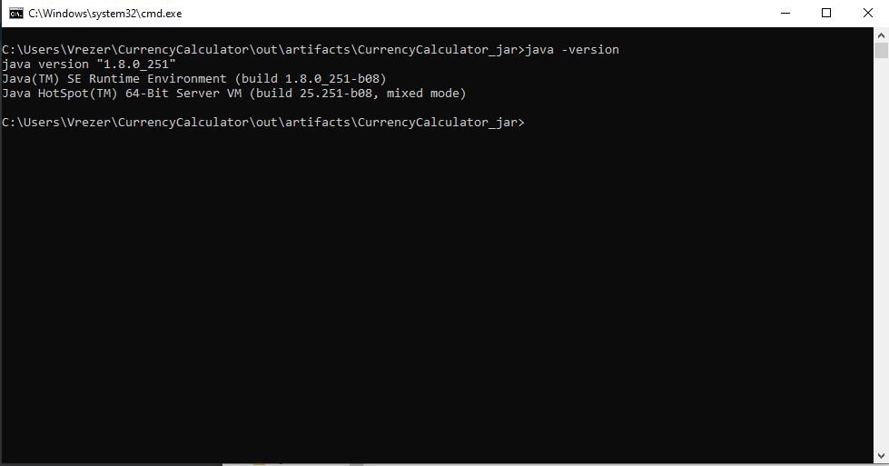
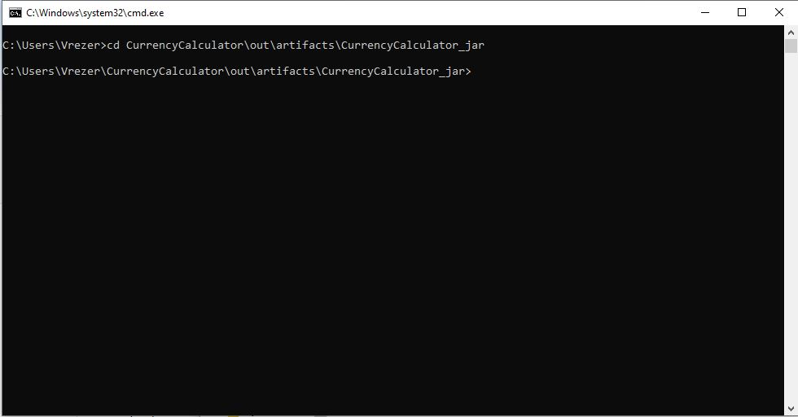
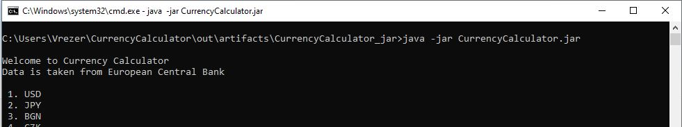
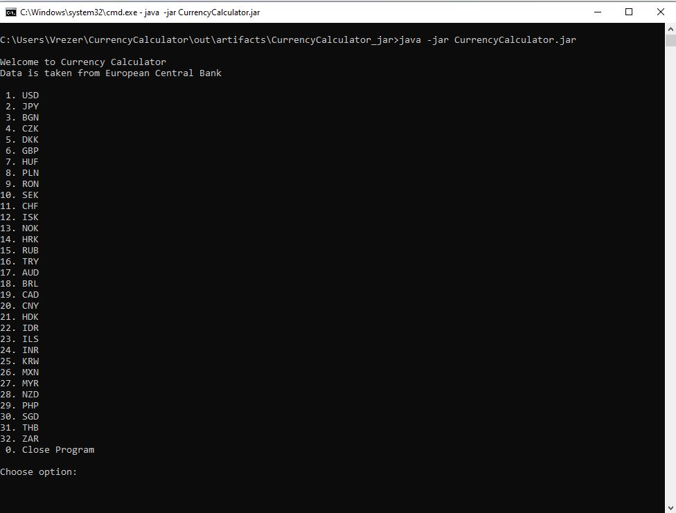
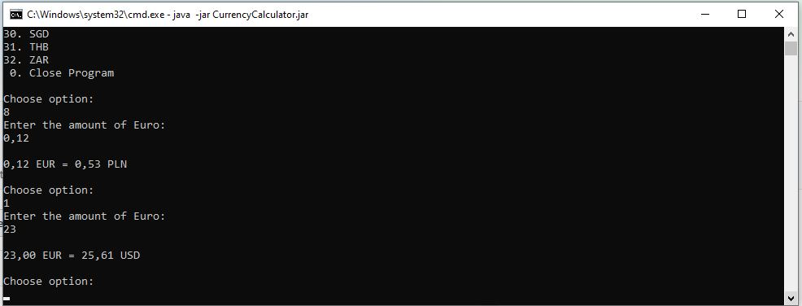
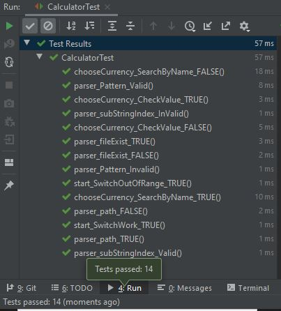
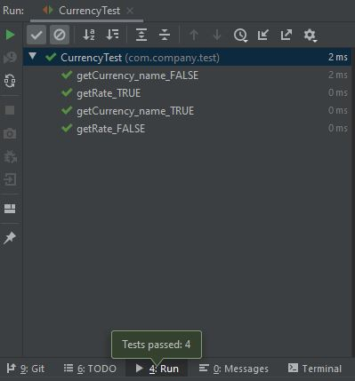

# CurrencyCalculator
Currency Calculator

>The "Currency Calculator" is a convenient and quick option to change your ammount. 

## General info
"Currency Calculator" is java application that uses data downloanded from file "eurofxref-daily.xml". 
File is taken from "https://www.ecb.europa.eu/stats/eurofxref/eurofxref-daily.xml". We can choose currency and exchange our ammount.

## Table of contents
* [General info](#general-info)
* [Setup](#setup)
* [Technologies](#technologies)
* [Screenshots Application](#screenshots-application)
* [Screenshots Application Test](#screenshots-application-test)
* [Contact](#contact)

## Setup
1. We need to have java 1.8 version

2. Open project file and  path: CurrencyCalculator\out\artifacts\CurrencyCalculator_jar
by command cd CurrencyCalculator\out\artifacts\CurrencyCalculator_jar

3. Use command java -jar CurrentCalculator.jar

## Technologies
*JAVA

## Screenshots Application

## Screenshots Application Test

## Contact
Created by Vrezer
e-mail: vrezer.ps@gmail.com
